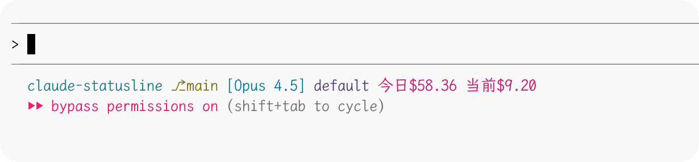

# Claude Code Statusline

为 Claude Code 添加实时费用统计状态栏，显示今日总消耗和当前会话消耗。



## 功能特点

- **今日消耗统计**：显示当天所有会话的累计费用
- **会话消耗统计**：显示当前会话的费用
- **增量更新**：高效的增量计算，不重复统计
- **自定义计费**：支持配置不同 API 服务商的计费规则
- **颜色提示**：根据费用高低显示不同颜色
- **跨平台支持**：同时支持 macOS/Linux 和 Windows

## 系统要求

### macOS / Linux

- Python 3.6+
- jq（JSON 处理工具）
- Bash

### Windows

- Python 3.6+
- PowerShell 5.1+

## 安装

### macOS / Linux

```bash
git clone https://github.com/your-username/claude-statusline.git
cd claude-statusline
chmod +x install.sh
./install.sh
```

### Windows

```powershell
git clone https://github.com/your-username/claude-statusline.git
cd claude-statusline
.\install.ps1
```

> **注意**：如果遇到 PowerShell 执行策略限制，请先运行：
> ```powershell
> Set-ExecutionPolicy -ExecutionPolicy RemoteSigned -Scope CurrentUser
> ```

## 配置计费规则

安装后，编辑计费配置文件：

- **macOS/Linux**: `~/.claude/pricing_config.json`
- **Windows**: `%USERPROFILE%\.claude\pricing_config.json`

```json
{
  "quota_per_unit": 500000,
  "group_ratio": 1.0,
  "models": {
    "claude-opus-4-5": {
      "model_ratio": 2.67,
      "completion_ratio": 5,
      "cache_ratio": 0.1,
      "cache_creation_ratio": 1.25
    },
    "claude-sonnet-4": {
      "model_ratio": 1.5,
      "completion_ratio": 5,
      "cache_ratio": 0.1,
      "cache_creation_ratio": 1.25
    }
  },
  "default": {
    "model_ratio": 2.67,
    "completion_ratio": 5,
    "cache_ratio": 0.1,
    "cache_creation_ratio": 1.25
  }
}
```

### 计费参数说明

| 参数 | 说明 |
|------|------|
| `quota_per_unit` | 每单位额度对应的 token 数 |
| `group_ratio` | 分组倍率（通常为 1.0） |
| `model_ratio` | 模型基础倍率 |
| `completion_ratio` | 输出 token 相对于输入的倍率 |
| `cache_ratio` | 缓存读取 token 的折扣比例 |
| `cache_creation_ratio` | 缓存创建 token 的倍率 |

### 计费公式

```
quota = (input + cache_read × cache_ratio + cache_creation × cache_creation_ratio + output × completion_ratio) × model_ratio × group_ratio
cost = quota / quota_per_unit
```

## 文件说明

安装后文件位于 `~/.claude/`（Windows: `%USERPROFILE%\.claude\`）：

| 文件 | macOS/Linux | Windows | 说明 |
|------|-------------|---------|------|
| 状态栏脚本 | `statusline.sh` | `statusline.py` | 主脚本 |
| 计费脚本 | `calculate_today_stats.py` | `calculate_today_stats.py` | 费用计算 |
| 核心模块 | `core/` | `core/` | 跨平台模块 |
| 计费配置 | `pricing_config.json` | `pricing_config.json` | 用户配置 |
| 统计状态 | `usage_state.json` | `usage_state.json` | 自动生成 |

## 卸载

### macOS / Linux

```bash
./uninstall.sh
```

### Windows

```powershell
.\uninstall.ps1
```

## 自定义状态栏

如需自定义显示内容：

- **macOS/Linux**: 编辑 `~/.claude/statusline.sh`
- **Windows**: 编辑 `%USERPROFILE%\.claude\statusline.py`

状态栏脚本接收 JSON 格式的上下文数据，包含：
- `model.display_name` - 当前模型名称
- `workspace.current_dir` - 当前工作目录
- `output_style.name` - 输出样式

## 常见问题

### Q: 费用统计不准确？

检查 `pricing_config.json` 中的计费规则是否与你的 API 服务商一致。

### Q: 状态栏不显示？

**macOS/Linux:**
1. 确保 `~/.claude/settings.json` 包含 statusLine 配置
2. 检查脚本权限：`chmod +x ~/.claude/statusline.sh`
3. 测试脚本：`echo '{}' | ~/.claude/statusline.sh`

**Windows:**
1. 确保 `%USERPROFILE%\.claude\settings.json` 包含 statusLine 配置
2. 测试脚本：`echo '{}' | python ~/.claude/statusline.py`

### Q: 如何重置统计？

删除状态文件：
- **macOS/Linux**: `rm ~/.claude/usage_state.json`
- **Windows**: `del %USERPROFILE%\.claude\usage_state.json`

### Q: Windows 上 PowerShell 脚本无法执行？

运行以下命令设置执行策略：
```powershell
Set-ExecutionPolicy -ExecutionPolicy RemoteSigned -Scope CurrentUser
```

## License

MIT
